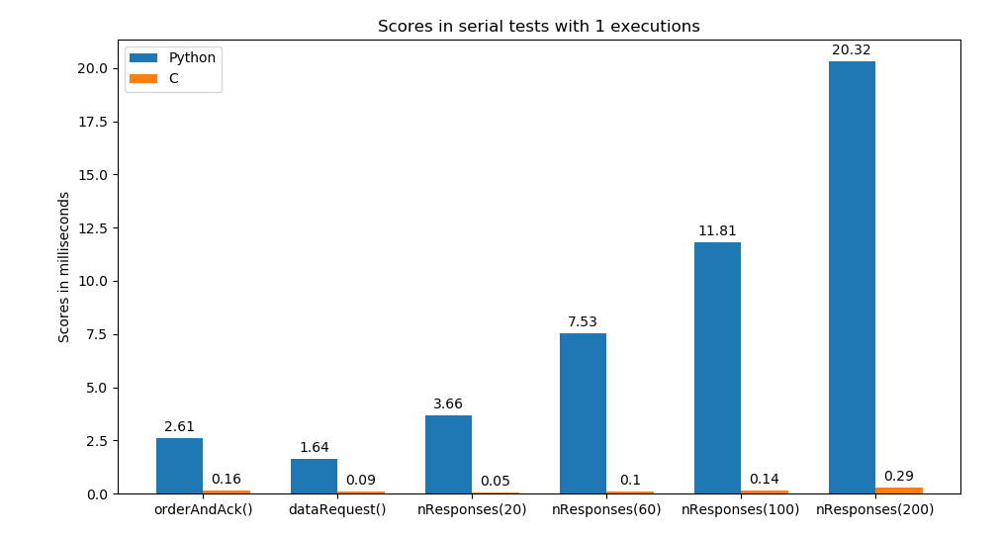
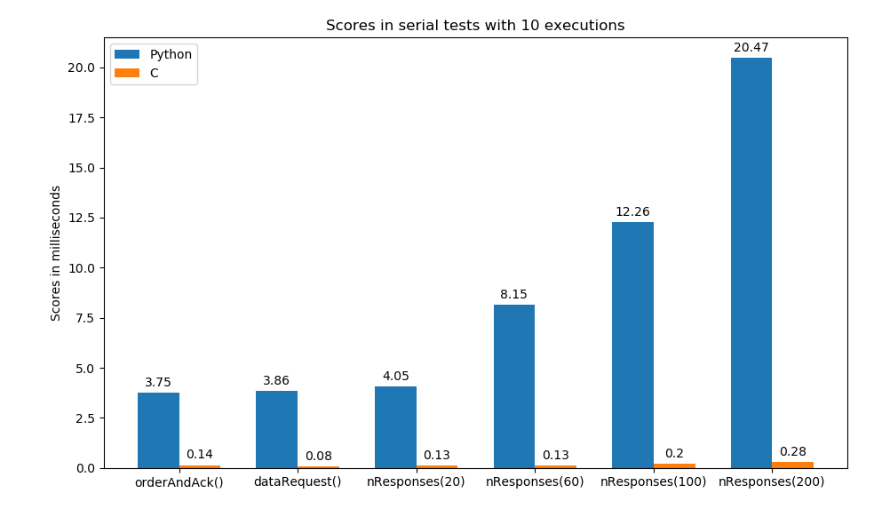
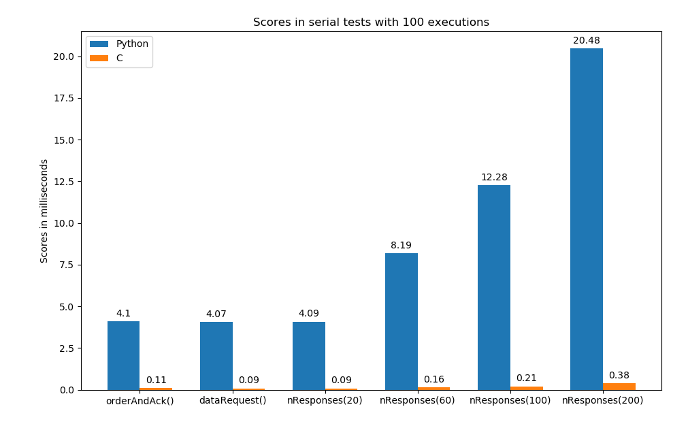

# Python_C_SerialComparison
This project is to perform a comparison between a custom C driver for serial communication and PySerial Python's library.

## Description
I used an Arduino UNO with a simple program to test diverse forms of comunications that could happen in real life.

Used 115200 bauds for tests.

Tests made:
* orderAndAck(): sends order and receives one byte
* dataRequest(): sends order and receives 2 data bytes and an ending byte. The idea would be to set the desired number of byte return and processing that could happen in our project.
* nResponses(n): we send order and receive n data bytes and one ending byte.

## Instructions
* First upload to Arduino with Arduino IDE the program in arduinoSerial/arduinoSerial.ino
* You may want to check the desired Arduino port (current /dev/ttyACM0)
* Then execute testSerial.py with Python3
* Compile and execute driverSerial.c
* Then show graphs with showResults.py

## Results
The results scores of multiple executions is measure with the average time.
One execution may not be fair but multiple executions could have noisy steps but we are interested in this because that would be the closest to a normal run.

Other way of measure is taking the best score of multiple executions to take the best case (other processes in OS could affect) but I thought it is not useful to a real scenario (but could be done for curiosity).

## Conclusions
* PySerial is great because you can make the program fast without much trouble.
* C takes more developing time and a learning curve of Linux API to make the driver.
* If you have to process data one after the other the time in PySerial rises a lot compared with our C program.
* For time critical aplications we need to use C.
